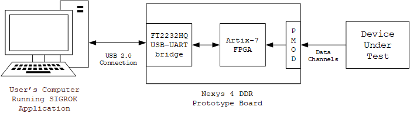
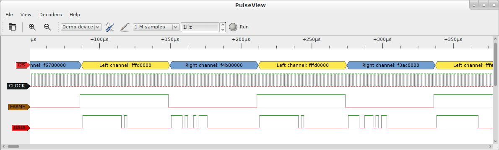

# System Implementation #

## Implementation Overview ##
<!-- [This chapter describes your implementation scope, used platform and language, dependent hardware/software, and implementation dependencies.] -->

The scope of this project consists of utilizing a Digilent Nexys 4 DDR Prototype board consisting of a Xilinx Artix-7 FPGA and numerous other on-board peripherals to form the prototype logical analyzer unit. The Nexys 4 development board connects to a PC via the USB connection for transmitting the sampling data from the logic analyzer to the host’s PC, as well as to send commands from the PC to the logic analyzer. Software implementation includes writing drivers to support the host-to-device connection, as well as using the sigrok API to allow the user to interface with the device. The physical hardware was set up as shown in the following figure.

{width=75%}

## Implementation of Developed Solutions ##
<!-- [Present the detailed solutions, such as techniques, methods, algorithms, etc.]  -->

### FPGA Implementation ###
The HDL of choice for this project was Verilog. While SystemVerilog was a desirable choice, many of the tools the team wished to use did not support SystemVerilog without a license or did not support open source use. The Xilinx Vivado suite provided tools for project creation, implementation, synthesis, verification, and validation. The Vivado tools also included the Memory Interface Generator, which was necessary in the creation to allow the FPGA to communicate with the DDR2 memory embedded into the Nexys 4 DDR board. The bitstream for the logic analyzer is stored on the SPI Flash module of the Nexys 4 DDR board, allowing the device to begin working immediately on power up.

### Software Implementation ###

{width=75%}

Sigrok was used as the software graphical user interface for the logic analyzer. After the signals are read and stored by the logic analyzer data path the read is complete and is sent to the PC through a UART connection. The signals are then parsed and stored for sigrok to read and display, allowing the user to analyze and decode them. Sigrok also serves as the users way of communicating with the logic analyzer during regular use. Sigrok sends opcode to the logic analyzer based on user commands in the GUI. The user is able to select the sample rate, choose a trigger pin, and start/abort a capture through the sigrok GUI.
In order to accomplish the communication protocol a driver was written giving sigrok a set of functions to call based on user input. This driver was written in C using UART communication through the USB port. When a user selects a command sigrok finds the function associated with that command and calls it. sigrok passes a UART instance to the function that it calls allowing that function to handle the communication with the logic analyzer. The function then sends the corresponding op code to the device. In some cases the function waits for the device to respond and then parses the response into a format that sigrok can then display to the user.
The driver also includes metadata about the device. This data includes the device name, version number, and the list of functions sigrok can use to communicate with the device.

## Implementation Problems, Challenges, and Lessons Learned ##

<!-- [High light the major implementation problems and challenges. It also summarizes the implementation lessons learned.] -->

### DDR2/DDR3 Challenges ###
Implementing DDR proved to be a challenge. While the IP generated by the Xilinx Memory Interface Generator worked in simulation and verification, validating the design using the Nexys 4 DDR platform proved troublesome. After creating a end-to-end test bench with a DDR2 model connected to the MIG and designing until the module passed the testbench we still were unable to get DDR2 communication on hardware. Due to the high speed nature of the DDR2 communication it is likely that there were clock issues caused by propagation delay and possible capacitance issues.
Because of the trouble with DDR2 communication we were unable to move to the desired DDR3 communication originally planned in our design. In order to get DDR2 working we communicated with Digilent, the designer of the Nexys 4 development board we are using.
