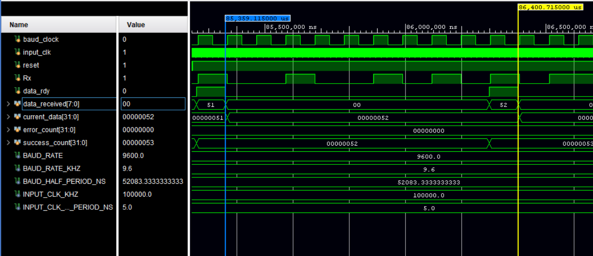
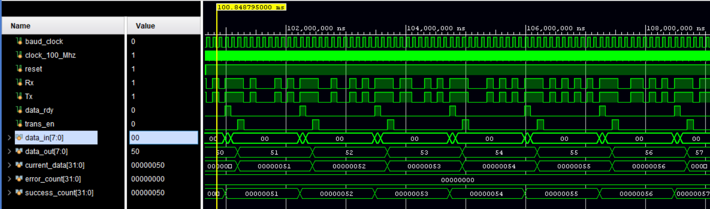
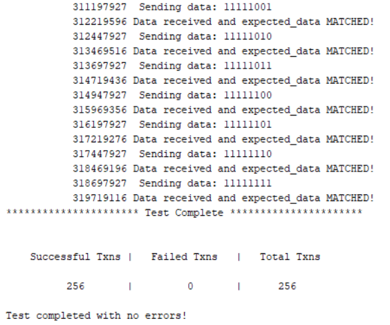
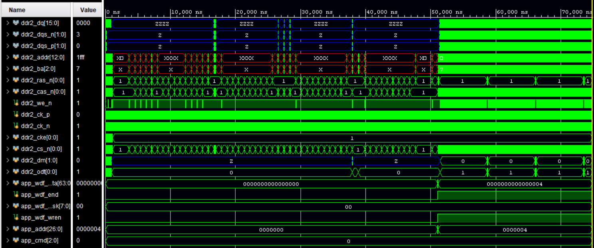
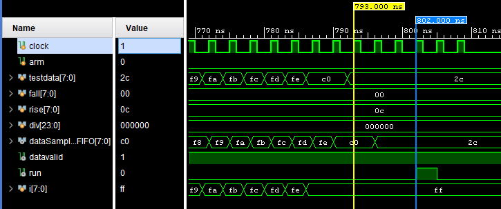

# Testings and Experiment ##

## Testings and Experiment Scope ##

<!-- [Describe an overview of your test process and experiment scope, including its test processes, test focuses and objectives, and selected test criteria at the component (e.g. unit testing) and system (e.g. integration testing) levels. This section must include textual description accompanied with figures and/or tables.] -->

The testing plan for the project was broken into three focal areas: unit testing of all verilog modules, communication testing between the host PC and the FPGA development board, and lastly, integration testing involving captures from other development boards.

## Testings and Experiment Approach ##

<!-- [Describe the selected test strategies, test methods and techniques, as well as selected test coverage criteria. Test design content and test design summary could be included here, such as test case distribution and summary. These results must tie back to the requirements stated earlier.  This section must include textual description accompanied with figures and/or tables.] -->

### Verilog Modules ###

The verilog testing followed the standard RTL testing method. First a testbench is written for functional verification of the module then the module is synthesized and tested on an FPGA. This testing method was done for every major module through each layer of abstraction. This starts at a unit level test and moves up to the full chip test. Modules with a small amount of inputs were tested exhaustively, while modules with a large input set were tested with both directed testing to test edge cases and random testing to increase coverage.
The functional verification was used to ensure the module acted as expected in every case it might be in. With FPGA’s the turnaround time from changing code to a uploading a bitstream onto the board is very large. Using functional verification helps find any bugs in the logic of the module in a much faster way. Functional verification is ran on a hardware simulator hosted on a PC. This simulation allows a testbench to be written to examine all the signals and verify their state. This also provides waveforms that can be used to see the state of the module and the timing each signal changes.
Hardware verification is required due to the fact that hardware does not always act the same way as the simulation. With hardware there can be issues with delays, metastable states, or other issues that can arise when running on a non simulated test environment. When the module is in hardware it is much more difficult to debug, so hardware test is not done until functional verification has been brought to a satisfactory level for that module.

<!-- ### PC-to-FPGA Communication ### -->

### Systems Integration and Sampling Tests ###

After extensive unit testing of individual verilog modules, a final top level test was built to simulate communication from a PC host to initiate a capture. Sample input data was generated for the simulation at random. By monitoring internal modules, verification of proper functionality was observed, leading the way to hardware validation.

Hardware validation was performed by attaching leads from the PMODs on the Nexys4 DDR to pins on a SJOne development board. The SJOne board has at its core has LPC1758 CPU along with many onboard components, including a SPI FLASH memory module. Hardware validation was accomplished by generating transfers of data from the SJOne board and confirming through Sigrok’s decoder that the correct data was being transferred.  

## Testing and Experiment Results and Analysis ##

<!-- [Describe testing and experiment results and analysis. For example, test execution and test result summary, performance test result analysis, test coverage, bug distribution report, and so on. This section must include textual description accompanied with figures and/or tables.] -->

{width=75%}

UART Receiver Test Bench - The transmission starts on the blue line transmitting the value of current data. Data received is the output of the receiver after transmission has completed (yellow line). This test was exhaustive due to the low amount of inputs (transmitting 8-bits requires only 256 transactions) 

{width=75%}

UART Transmitter Test Bench - Similar design to the receiver this test bench transmits every possible value for the 8-bits it is transmitting and ensures all values are transmitted correctly.

{width=75%}

UART Transmitter Test Sample Output Showing the last 7 transactions, this is used as a high level look into how the test went, waveforms were also inspected and verified.

{width=75%}

DDR2 testbench waveform - The DDR2 was tested by generating random traffic and ensuring the proper signals were sent and the correct value was stored. 

### Sampler / Trigger Unit Testing ####

The sampler and trigger unit were tested together to assure that frequency divisions of the sampler were successfully being accomplished through the use of the `datavalid` signal, along with proper triggering on a given rising/falling mask. The figure below shows how there is a four cycle delay between when sample data entered the device before the pattern is detected which triggers it.

{width=75%}

Sampler-Trigger Test Bench showing four rising clock edges between input until trigger (run).
